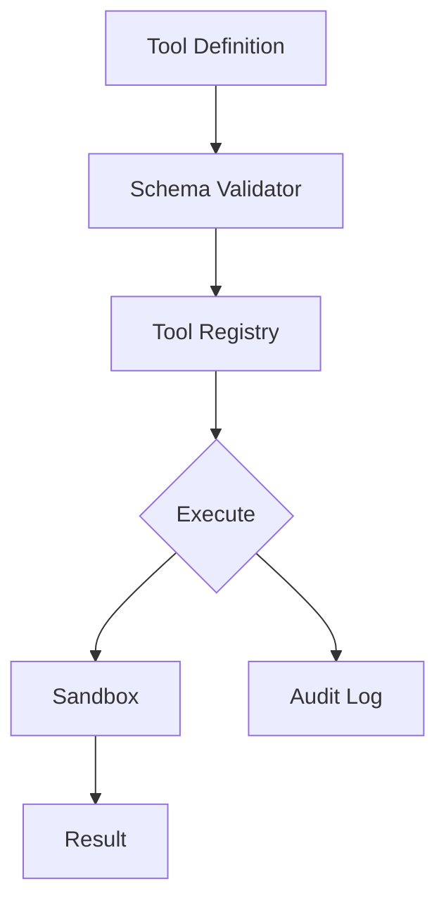

# 🔥 ToolSmith

> Dynamic tool creation and registry for LLM agents

[](https://github.com/MukundaKatta/ToolSmith/actions)
[](LICENSE)
[]()

## What is ToolSmith?
ToolSmith is a tool registry and execution framework for LLM agents. Define tools with JSON schemas, register them at runtime, validate inputs, and execute them safely — all with built-in sandboxing and audit logging.

## ✨ Features
- ✅ JSON Schema-based tool definitions
- ✅ Runtime tool registration and discovery
- ✅ Input validation against schemas
- ✅ Execution sandboxing with timeouts
- ✅ Audit logging of all tool calls
- 🔜 Tool composition (chain tools together)
- 🔜 Natural language tool creation

## 🚀 Quick Start
```bash
pip install toolsmith-ai
```
```python
from toolsmith import ToolRegistry, tool

registry = ToolRegistry()

@tool(name="calculator", description="Perform math operations")
def calculator(expression: str) -> float:
    return eval(expression)  # sandboxed in production

registry.register(calculator)
result = registry.execute("calculator", {"expression": "2 + 2"})
```

## 🏗️ Architecture


## 📖 Inspired By
Inspired by OpenAI's function calling and Anthropic's tool use patterns, but built as a standalone framework for any agent system.

---
**Built by [Officethree Technologies](https://github.com/MukundaKatta)** | Made with ❤️ and AI
